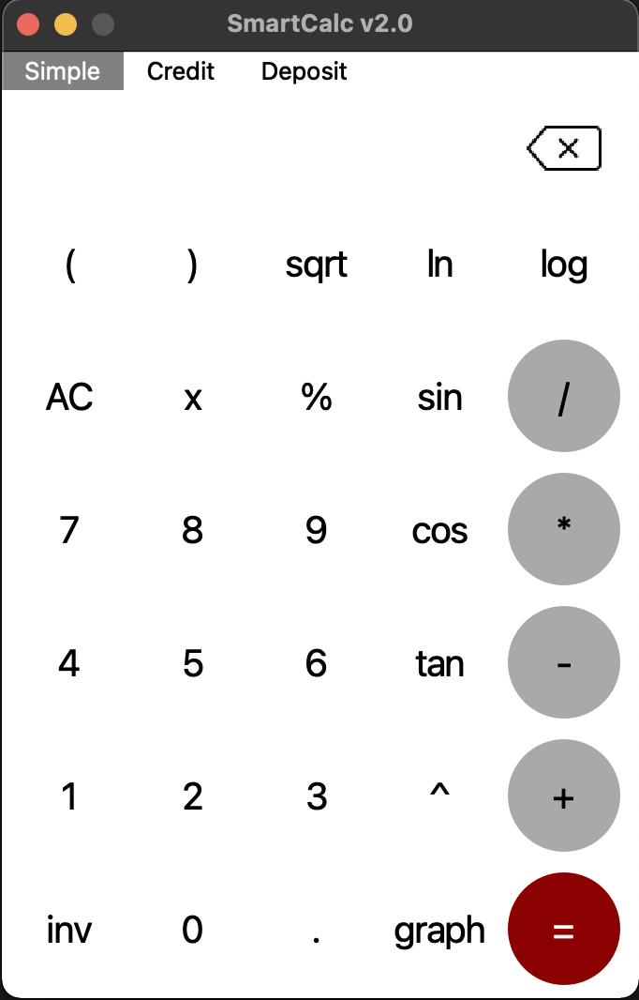
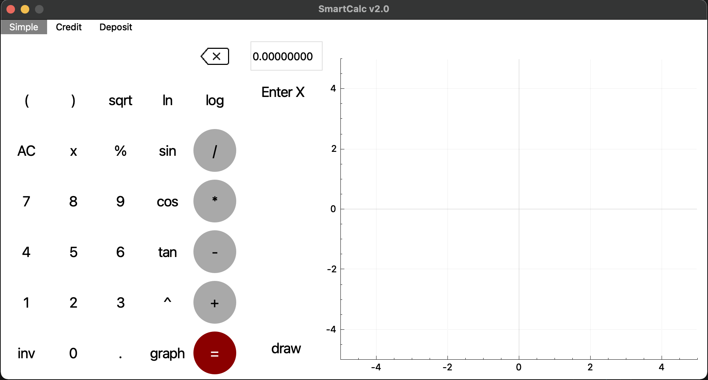
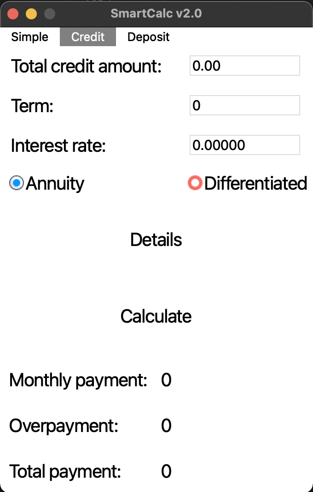
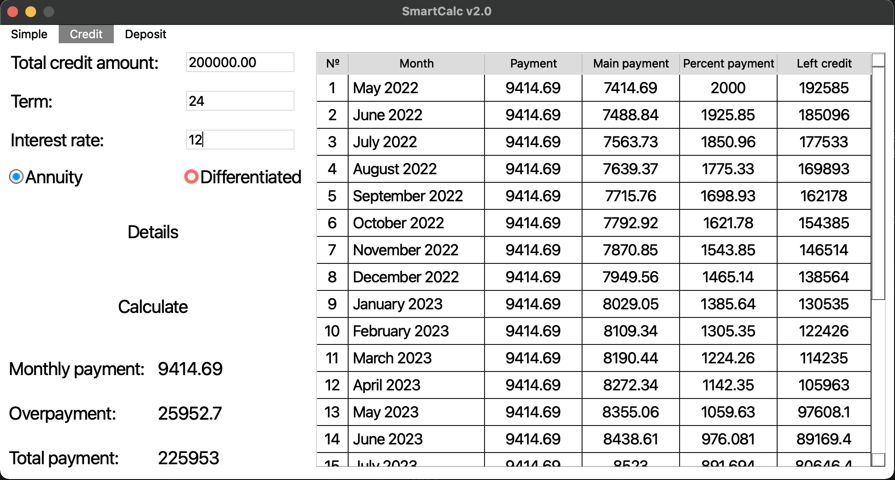

<h1><b>Calculator</b></h1>

<h2><b>GENERAL INFO</b></h2>
Desktop calculator on C++ using Qt. 
Application provides calculator for arithmetic operations and credit calculatoins. 

The project is implemented and tested on macOS.

<h2><b>SIMPLE CALCULATOR</b></h2>
  

    By selecting <b>Simple</b> from the tab menu of the calculator, users can access the Simple Calculator as shown
    below.
  

  

  

    The Simple Calculator can be used to perform the operations of addition, subtraction, multiplication,
    division, modulo and power. It also has the ability to recognize both positive and negative numbers. It
    recognizes parentheses and operations priority. As scientific calculator it can recognize logarithmic and
    trigonometric functions.
  

  
The table below gives the functions and keyboard shortcuts for the buttons on the Simple Calculator. 

  <table border="1" cellspacing="0">
    <tr>
      <th>Button</th>
      <th>Keyboard Shortcut</th>
      <th>Function</th>
    </tr>
    <tr>
      <td>0, 1, 2, 3, 4, 5, 6, 7, 8, 9</td>
      <td>0, 1, 2, 3, 4, 5, 6, 7, 8, 9</td>
      <td>Enters digits 0 through 9</td>
    </tr>
    <tr>
      <td>+</td>
      <td>+</td>
      <td>Adds</td>
    </tr>
    <tr>
      <td>-</td>
      <td>-</td>
      <td>Subtracts</td>
    </tr>
    <tr>
      <td>*</td>
      <td>*</td>
      <td>Multiplies</td>
    </tr>
    <tr>
      <td>/</td>
      <td>/</td>
      <td>Divides</td>
    </tr>
    <tr>
      <td>%</td>
      <td>%</td>
      <td>Takes the modulo</td>
    </tr>
    <tr>
      <td>^</td>
      <td>^</td>
      <td>Exponentiates</td>
    </tr>
    <tr>
      <td>(, )</td>
      <td>(, )</td>
      <td>Enters left and right parentheses</td>
    </tr>
    <tr>
      <td>.</td>
      <td>.</td>
      <td>Inserts decimal point</td>
    </tr>
    <tr>
      <td>x</td>
      <td>x</td>
      <td>Inserts variable x</td>
    </tr>
    <tr>
      <td>sqrt</td>
      <td></td>
      <td>Takes the square root</td>
    </tr>
    <tr>
      <td>ln</td>
      <td></td>
      <td>Takes natural logarithm</td>
    </tr>
    <tr>
      <td>log</td>
      <td></td>
      <td>Takes decimal logarithm</td>
    </tr>
    <tr>
      <td>sin, cos, tan</td>
      <td></td>
      <td>Takes sine, cosine and tangent</td>
    </tr>
    <tr>
      <td>inv</td>
      <td></td>
      <td>Switches buttons between x/e, sin/asin, cos/acos, tan/atan</td>
    </tr>
    <tr>
      <td>asin, acos, atan </td>
      <td></td>
      <td>Takes arcsine, arccosine and arctangent</td>
    </tr>
    <tr>
      <td>e</td>
      <td></td>
      <td>Inserts e</td>
    </tr>
    <tr>
      <td> </td>
      <td>Backspace</td>
      <td>Deletes last digit, button, or keystroke entered</td>
    </tr>
    <tr>
      <td>AC</td>
      <td></td>
      <td>Resets calculator and clears memory </td>
    </tr>
    <tr>
      <td>=</td>
      <td>= or Enter</td>
      <td>Performs previously entered operation(s)</td>
    </tr>
    <tr>
      <td>graph</td>
      <td></td>
      <td>Shows/hides special graph panel</td>
    </tr>
  </table>
  <h2><b>GRAPHS</b></h2>
  

    The graph panel of the Calculator can be accessed by clicking the <b>graph</b> button from the Simple Calculator
    screen. Only one graph can be drawed at a time. Graph field has the ability to resize drawed graph. The graph panel
    has the default settings shown below.
  

  

  
The table below gives the functions for the buttons of the Graphing Panel.

  <table border="1" cellspacing="0">
    <tr>
      <th>Button</th>
      <th>Function</th>
    </tr>
    <tr>
      <td>Enter X field</td>
      <td>Substitutes entered number instead of variable x in calculation expression</td>
    </tr>
    <tr>
      <td>draw</td>
      <td>Draw graph of entered expression</td>
    </tr>
  </table>
  <h3><b>CREDIT CALCULATOR</b></h3>
  

    By selecting <b>Credit</b> from the tab menu of the calculator, users can access the Credit Calculator as shown
    below.
  

  

  

    The Credit Calculator can be used to perform the calculation of credit overpayment, monthly and total payment. It
    also has the ability to recognize both annuity and differentiated types. It also has the ability to set amount, term
    and interest rate of the credit. It calculates detailed information about credit and fill it in table as shown
    below.
  

  

  
The table below gives the functions for the buttons of the Credit Calculator.

  <table border="1" cellspacing="0">
    <tr>
      <th>Button</th>
      <th>Function</th>
    </tr>
    <tr>
      <td>Details</td>
      <td>Shows/hides detailed information table about credit</td>
    </tr>
    <tr>
      <td>Calculate</td>
      <td>Performs credit calculations with entered values</td>
    </tr>
  </table>
